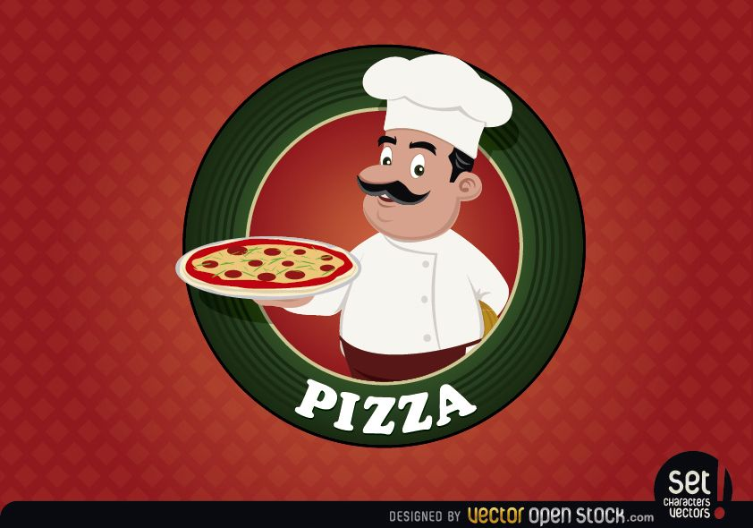
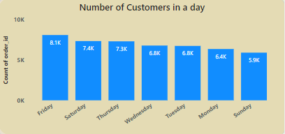
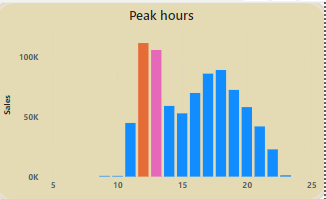
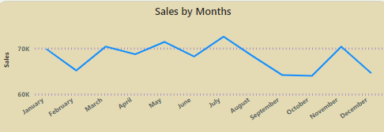
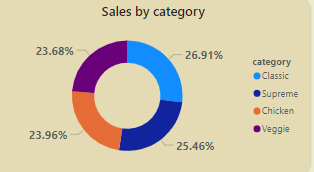
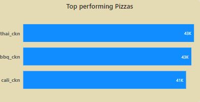
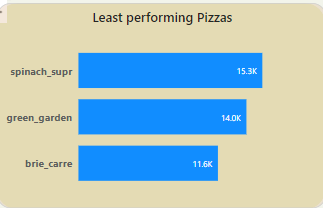
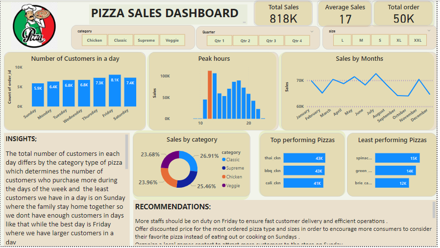

# Pizza-Sales-Report

## Introduction
Things are going OK here at Plato's, but there's room for improvement. They've been collecting transactional data for the past year, but really haven't been able to put it to good use. Hoping we can analyze the data and put together a report to help us find opportunities to drive more sales and work more efficiently.

## About DataSet
This pizza sales dataset make up 12 relevant features:

**_order_id_**: Unique identifier for each order placed by a table

**_order_details_id_**: Unique identifier for each pizza placed within each order (pizzas of the same type and size are kept in the same row, and the quantity increases)

**_pizza_id_**: Unique key identifier that ties the pizza ordered to its details, like size and price quantity: Quantity ordered for each pizza of the same type and size order_date: Date the order was placed (entered into the system prior to cooking & serving) order_time: Time the order was placed (entered into the system prior to cooking & serving) unit_price: Price of the pizza in USD total_price: unit_price * quantity pizza_size: Size of the pizza (Small, Medium, Large, X Large, or XX Large)

**_pizza_type_**: Unique key identifier that ties the pizza ordered to its details, like size and price pizza_ingredients: ingredients used in the pizza as shown in the menu (they all include Mozzarella Cheese, even if not specified; and they all include Tomato Sauce, unless another sauce is specified) pizza_name: Name of the pizza as shown in the menu

## Business Tasks
1.	How many customers do we have each day? Are there any peak hours?
2.	How many pizzas are typically in an order? Do we have any bestsellers?
3.	How much money did we make this year? Can we identify any seasonality in the sales?
4.	Are there any pizzas we should take of the menu, or any promotions we could leverage?

## Problem Approach:
•	I connected and transformed raw data from Excel files and designed interactive reports and dashboards to complete the task.
•	I re-modelled the data relationship.
•	I created an executive KPI dashboard containing dynamic filtering options, high-level trending metrics, sales 

## Analysis
Analysis was done on Power Query and visualized on Power BI..

## Findings
Year considered - 2015
Total_Orders - 48,620
Number_of_pizza_types - 32
Total_Quantity_Sold - 49,574
Total_revenue - $817,860.05
Average_revenue - $16.82

## Insights

The busiest days are Fridays and Saturdays (Beginning of the weekend). With Fridays having a total of 8,106 orders, 8,242 quantities of pizzas made, and revenue generation of $136,073.9. While on Saturdays, orders received was 7,355, with a total of 7,493 pizzas made and revenue generation of $123,182.4. The total number of customers in each day differs by the category type of pizza which determines the number of customers who purchase more during the days of the week and the least customers we have in a day is on Sunday where the family stay home together so we dont have enough customers in days like that while the best day is Friday where we have larger customers.

The peak hours for each day is by 12 pm and 13:00 in that time we make more sales where we have the highest quantity and its the same across all the categories of the pizza type we have which infer that most customers do order pizza during the lunch period. A total of 6,543 orders was received, 6,776 quantites of Pizzas were made and revenue generated was $111,877.9 while for 1pm, a total of 6,203 orders was received, 6,413 quantities of Pizza made and revenue generated was $106,065.7.

July is the top performing month with a total of 4,301 orders, 4,392 pizzas sold and revenue generation of $72,557.9. The least performing month is October with 3,797 orders, 3,883 quantities of pizza sold and revenue generation of $64,027.6.

The highest sold pizza by category is the classic pizza which has sales of 26.91% followed by supreme which has a sales percent of 25.46% chicken has sales of 23.96% and Veggie has a sales of 23.68% but all these varies by the pizza sizes.

The best selling pizza is the Thai Chicken Pizza with the total sales of $43,434 this year, followed by the Barbecue Chicken Pizza with sales of $42,768 and the California chicken pizza with a sales of $41,409.

The Brie Carre Pizza should be taken off the menu it has the least sales of about $11,600. The reasons for its poor sales is the ingredient and size. The Brie Carre is only offered in small size and contain Thyme and Garlic as part of the ingredient which may affect the taste and be the reason for a small number of consumers.

## Visualization
You can interact with the report [here](https://app.powerbi.com/groups/835d2acb-e740-4b27-b347-59f56bd1a269/reports/04901254-fc69-4d3a-8fc7-719561ecb701/ReportSectiond43bbe951727259c7adc)

## Conclusion
Pizza orders and revenue maintains an upward trajectory from the beginning of the week Sunday and peaks on Friday before it starts dropping, this means most people prefer to eat pizza towards and during the weekend. Most people prefer to have the Pepperoni pizza for lunch on Fridays. It is advisable to make available tables and chairs to be able to accomodate the influx of the weekend, we can also explore the option of delivery services. The Ingrdients for Pepperoni pizza should be made readily available and in large quantities on or before Fridays. Since more orders are received on Fridays, a discount policy can be introduced every last Friday of the month where a customer gets 1 extra pizza when they buy 3 and above, this will encourage them to buy more.

## Recommendations
More staffs should be on duty on Friday to ensure fast customer delivery and efficient operations .
Offer discounted price for the most ordered pizza type and sizes in order to encourage more consumers to consider their favorite pizza instead of eating out or cooking on Sundays .
Organize a local games contest to attract more customers to the store on Sunday.
Promotional campaigns should be targeted towards the second half of the year.
Emphasis should be on September, October and December. It is pertinent to investigate and fix why sales decline in ember months, December especially. The staff should be compensated during the peak months of sales.
The Brie Carre Pizza is the least selling Pizza but it is the most expensive small size pizza selling at the rate of $23 a piece , Introduce more variety of sizes for the Brie Carre . Also run a promotional campaign Ads using the medicinal benefits of the ingredients as USP

